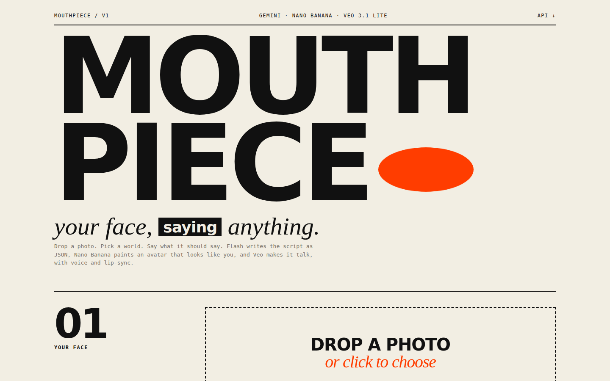
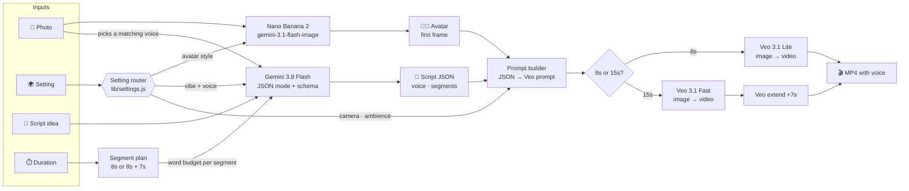
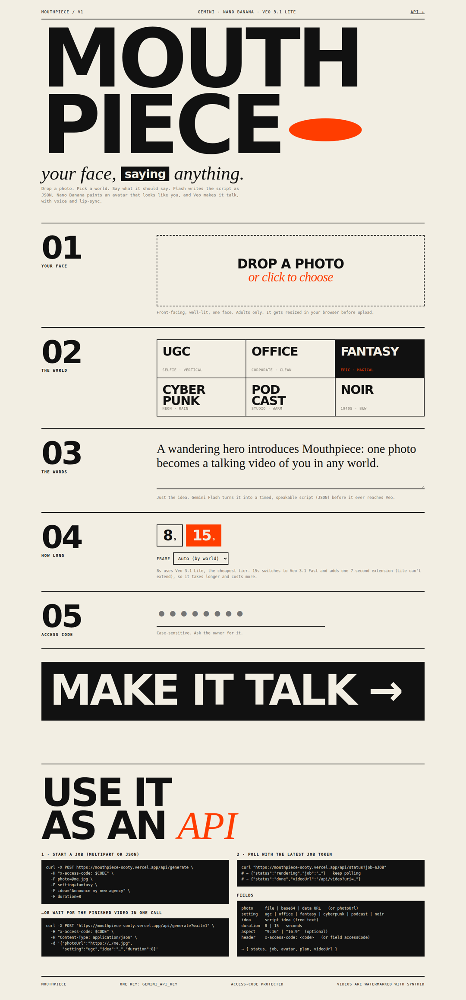
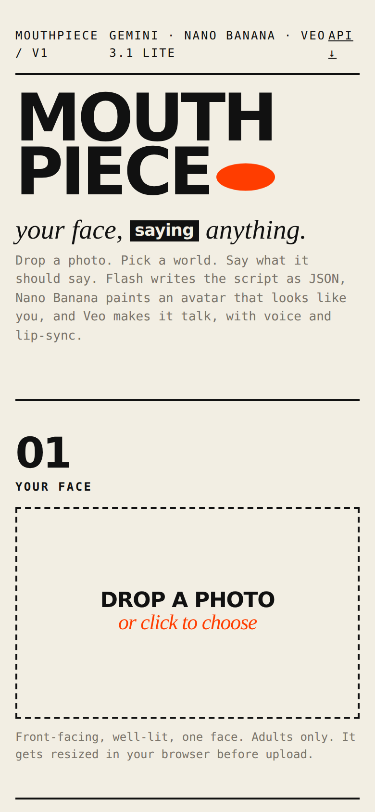

<div align="center">

# MOUTHPIECE

### *your face, saying anything.*

**One photo in → a talking AI avatar video out.**
Pick a world, type an idea, choose a length. Gemini writes the script, paints an avatar that looks like you, and Veo makes it talk with its own voice and lip-sync.

**[mouthpiece-sooty.vercel.app](https://mouthpiece-sooty.vercel.app)** · access-code protected



</div>

---

## What it does

| You give it | It gives you |
|---|---|
| 📸 **A photo** of a face | 🧑‍🎨 An **avatar** that still looks like that person, restyled for the world you picked |
| 🌍 **A setting**: UGC, Office, Fantasy, Cyberpunk, Podcast or Noir | 📝 A **timed script** as structured JSON |
| 💬 **A script idea**, one line is enough | 🎬 A **video** of the avatar speaking the script to camera, with voice and lip-sync |
| ⏱️ **A length**: 8 or 15 seconds | 🔌 All of it through a **REST API** too |

Everything runs on **one Gemini API key**. No ElevenLabs and no separate TTS: Veo generates the voice itself from the quoted dialogue.

---

## The flow



### Step by step

1. **Upload.** The browser shrinks the photo to 1280px JPEG before sending it, so requests stay well under Vercel's 4.5 MB body limit.
2. **Two calls run in parallel** (about 8 seconds total):
   - **Script → JSON.** `gemini-3.8-flash` gets your idea, the setting's vibe, the photo (so the voice fits the person) and a word budget for each segment (about 2.3 words per second). Structured output with a JSON schema returns:
     ```json
     {
       "title": "Mouthpiece App UGC Teaser",
       "voice": "rich, charismatic male voice, mid-30s, cinematic storytelling tone",
       "segments": [
         { "dialogue": "Every legend begins with a face…", "action": "raises a hand toward the horizon", "emotion": "awed", "seconds": 8 },
         { "dialogue": "Speak your destiny into any realm…", "action": "steps closer, smirking", "emotion": "confident", "seconds": 7 }
       ]
     }
     ```
   - **Photo → avatar.** `gemini-3.1-flash-image` (Nano Banana 2) repaints the person in the chosen world. The prompt tells it to keep their identity: face shape, eyes, skin tone, hair and age.
3. **JSON → Veo.** Each segment becomes a directed Veo prompt: scene, performance, `They say, in a <voice>: "<dialogue>"`, camera move, ambient sound, and "no subtitles". The avatar is the first frame.
4. **Render.**
   - **8s** → one clip on **Veo 3.1 Lite**, the cheapest tier.
   - **15s** → an 8s clip on **Veo 3.1 Fast**, then one 7-second **extension** that keeps the same voice and scene. Lite can't extend.
5. **Poll → play.** The client polls `/api/status`. For 15s jobs, the server starts the extension by itself once the first clip finishes. The final MP4 streams through `/api/video`, because Google's file URLs need the API key.

### Settings routing

Each world changes **four things at once**: the avatar's look, Veo's scene direction, the camera, and the sound.

| Setting | Frame | Avatar | Camera | Sound / voice |
|---|---|---|---|---|
| **UGC** | 9:16 | phone-selfie, cozy room, natural light | handheld front-cam | room tone · upbeat creator |
| **Office** | 16:9 | corporate headshot, glass office | locked-off tripod MCU | office hum · confident presenter |
| **Fantasy** | 16:9 | heroic adventurer, enchanted forest | slow cinematic push-in | wind, birds · storyteller |
| **Cyberpunk** | 16:9 | techwear, neon rain | slow anamorphic dolly | rain, city drone · cool & low |
| **Podcast** | 16:9 | broadcast mic, warm studio | static off-center | intimate room · warm host |
| **Noir** | 16:9 | 1940s trench coat, blinds, B&W | low-key push-in | rain, ticking clock · hard-boiled |

Add a new world by adding one object to [`lib/settings.js`](lib/settings.js) and one tile in `public/index.html`.

---

## The site

Minimal, loud, editorial: **Unbounded 900** for the giant display type, **Instrument Serif** italics for the voice, **JetBrains Mono** for the details. Paper, ink, and one vermilion accent. The red mouth in the logo lip-syncs on a loop.

<table>
<tr>
<td width="68%"></td>
<td width="32%" valign="top"></td>
</tr>
</table>

---

## API

Every request needs the access code, either in the `x-access-code` header or as an `accessCode` field.

**Start a job**

```bash
curl -X POST https://mouthpiece-sooty.vercel.app/api/generate \
  -H "x-access-code: $CODE" \
  -F photo=@me.jpg \
  -F setting=fantasy \
  -F idea="Announce my new agency" \
  -F duration=8
```

```json
{ "status": "rendering", "job": "eyJvcCI6…", "avatar": "data:image/png;base64,…", "plan": { … }, "videoModel": "veo-3.1-lite-generate-preview" }
```

**Poll with the latest `job` token until it's done**

```bash
curl "https://mouthpiece-sooty.vercel.app/api/status?job=$JOB"
# {"status":"rendering","step":1,"steps":2,"job":"…"}   ← keep polling with this new token
# {"status":"done","videoUrl":"/api/video?uri=…"}
```

**Or block until the video is ready (≤ ~4.5 min)**

```bash
curl -X POST "https://mouthpiece-sooty.vercel.app/api/generate?wait=1" \
  -H "x-access-code: $CODE" -H "Content-Type: application/json" \
  -d '{"photoUrl":"https://…/me.jpg","setting":"ugc","idea":"…","duration":8}'
```

| Field | Values |
|---|---|
| `photo` | file (multipart), base64, or data URL. **Or** `photoUrl` (https image) |
| `setting` | `ugc` `office` `fantasy` `cyberpunk` `podcast` `noir` |
| `idea` | free-text script idea |
| `duration` | `8` or `15` seconds |
| `aspect` | optional `9:16` / `16:9` (default depends on setting) |

| Endpoint | |
|---|---|
| `POST /api/generate` | script + avatar + start Veo |
| `GET/POST /api/status` | poll; runs the extension for 15s jobs |
| `GET /api/video?uri=` | streams the MP4 (`&download=1` to save) |
| `GET /api/health` | config + model check |

---

## Architecture

The project has no framework and no build step. There are no npm dependencies and no database.

```
public/index.html   the entire frontend (HTML + CSS + JS, ~20 KB)
api/generate.js     POST: validate → access check → script ∥ avatar → start Veo
api/status.js       poll a job, auto-chain extensions
api/video.js        proxy Veo's MP4 (keeps the API key server-side)
api/health.js       config check
lib/settings.js     the 6 worlds + duration (8s / 15s) → segment plan
lib/gemini.js       all Google calls: Flash, Nano Banana, Veo start/extend/poll
lib/pipeline.js     orchestration
lib/http.js         input parsing, access gate, signed job tokens
dev.js              local server that mimics Vercel
```

**Stateless jobs.** There's no DB. The whole job (Veo operation id, current segment, script JSON) is packed into an HMAC-signed token. Each poll sends it back, and the server verifies it, checks Veo, and returns an updated token. Forged or edited tokens are rejected.

### Security

- **Access code**: exact and case-sensitive. It's compared in constant time: both sides are SHA-256 hashed, then `crypto.timingSafeEqual`, so response timing gives nothing away. Wrong attempts get an 800 ms penalty to slow down guessing. The code is accepted only in a header or the body, never the URL, so it stays out of logs.
- **No unauthenticated fetches**: `photoUrl` is fetched only *after* the access check, and only https URLs that return an image.
- **Key never leaves the server**: videos are proxied, and `/api/video` accepts only Google `generativelanguage` file URLs.
- **Veo safety**: `personGeneration: allow_adult`. Every Veo video carries a SynthID watermark.

---

## Models & cost

| Step | Model | Why |
|---|---|---|
| Script → JSON | `gemini-3.8-flash` | structured output, sees the photo; costs fractions of a cent |
| Avatar | `gemini-3.1-flash-image` (Nano Banana 2) | best likeness. Set `IMAGE_MODEL=gemini-3.1-flash-lite-image` for about half the price |
| Video 8s | `veo-3.1-lite-generate-preview` | **cheapest Veo tier**, 720p |
| Video 15s | `veo-3.1-fast-generate-preview` | Lite can't extend. Fast is the cheapest tier that can |

Every model can be overridden with env vars. Veo bills per second of video, so **8s on Lite is the cheapest way to use this**.

---

## Run & deploy

```bash
# local
GEMINI_API_KEY=... ACCESS_CODE=... node dev.js     # → http://localhost:3000

# deploy
vercel env add GEMINI_API_KEY production
vercel env add ACCESS_CODE production
vercel deploy --prod
```

| Env var | |
|---|---|
| `GEMINI_API_KEY` | **required**. Veo needs billing enabled |
| `ACCESS_CODE` | recommended. Protects your Veo credits |
| `SCRIPT_MODEL` `IMAGE_MODEL` `VIDEO_MODEL` `VIDEO_LONG_MODEL` | optional overrides |

---

<div align="center">
<sub>Built with Gemini · Nano Banana · Veo 3.1 on Vercel</sub>
</div>
